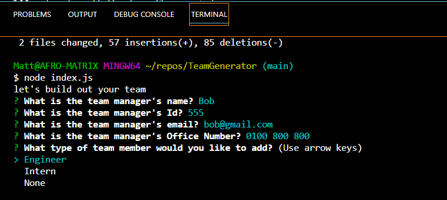
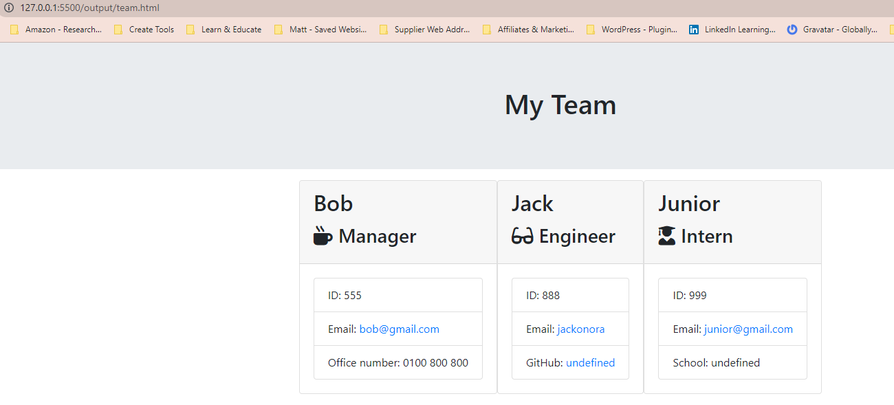

# TeamGenerator

## Table of Contents:
* [Description](#description)
* [Getting Started](#getting-started)
* [Usage](#usage)
* [Reference](#reference)

## Description
The Team Generator application allows you to create quick and easy team profile accounts and generate them on to a HTML page for live server viewing.

### For the Manager, we have included:
* Manager's name
* Manager's Id number
* Manager's Email Address
* Manager's Office Number

### For the Engineer, we have included:
* Engineer's name
* Engineer's Id number
* Engineer's Email Address
* Engineer's GitHub username

### For the Intern, we have included?
* Intern's name
* Intern's Id number
* Intern's Email Address
* Intern's School

I have implemented the extra task by having the user validate their email address using the '@' as one of the key symbols to enable a user to bypass the prompts. If the user does not provide a valid email address, they will be prompted, allowing the user to edit the original input line.

## Getting Started
It works by assigning team roles

First we create a new folder for our project and open it in VS Code.
In the terminal we initialize a new Node.js project by running 'npm init'. This will create a package.json file in the project folder.
3. We then install the inquirer package by running the 'npm install inquirer'. This package allows us to ask the user the input in the comman line.

4. We then create a new file called 'index.js' in our project folder. This file contains our code for our HTML team generator.

5. In 'index.js' we wimport the inquirer package and created a list of questions to ask the user.

6. We used the inquirer package to prompt the user with the questions and get their answers.

7. We used the fs module to create a new HTML file and write the generated HTML code to it.

8. We run the 'index.js' file in the terminal by running the 'node index.js' which prompts the user with the questions and generates the HTML team page.

## Usage
* The user will use the Command Line in the Terminal typing in "node index.js" where they will be answered a set of straightforwad questions regarding their requirements.
* The user answers the set of prompt questions and fills it in with their accurate credientials.
* During the prompts the user can add team members to collabrate with or include them on the HTML generated page to form a team.
* Once the prompts in the command line have been completed the HTML page will generate and the user can view on live server and can sent a URL link to their team members for sharing.

## Reference
Please use these screenshots are references:

